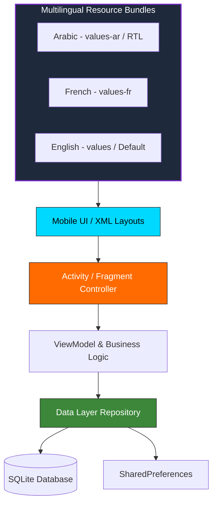

<div align="center">

<!-- Header Banner -->


<!-- Typing Animation -->
<p align="center">
  
</p>

<!-- Quality & Community Badges -->
<p align="center">
  <a href="LICENSE"></a>
  <a href="https://github.com/Bosaj/eniad-android-mobile-suite/actions"></a>
  <a href="https://github.com/Bosaj/eniad-android-mobile-suite/stargazers"></a>
  <a href="https://github.com/users/Bosaj/projects/36"></a>
  <a href="https://github.com/stars/Bosaj/lists/eniad-academic-projects"></a>
  
</p>

</div>

<!-- Divider -->


## 📖 Overview

**ENIAD Native Android Mobile Architecture Suite** is an official engineering laboratory suite developed within the **State Engineering Degree in Artificial Intelligence & Digital Systems** at the **École Nationale d'Intelligence Artificielle et du Digital (ENIAD)**, Mohammed First University, Berkane, Morocco.

Native Android Engineering Suite featuring Clean Architecture, Material Design UI, Full Trilingual Localization (Arabic RTL, French, English), and SQLite Data Persistence.

---

## 🏗️ Technical Architecture



---

## 📂 Curriculum & Laboratory Breakdown

| Module / Lab | Architecture Focus | Features & Deliverables |
|---|---|---|
| `Activity Lifecycles` | Android Fundamentals | State preservation, intent navigation, bundle parameter passing |
| `Layouts & Material UI` | UI/UX Engineering | ConstraintLayout, CoordinatorLayout, RecyclerView with custom adapters |
| `Multilingual Support` | Internationalization | Dynamic runtime localization: Arabic (RTL), French, and English |
| `Data Persistence` | Storage Architecture | SQLite Database helper, CRUD operations, SharedPreferences settings |
| `Build Automation` | Gradle Kotlin DSL | `build.gradle.kts`, `settings.gradle.kts`, dependency version management |


---

## 📚 Technical Wiki & Documentation

Comprehensive architectural explanations, step-by-step lab walk-throughs, and methodology guides are available:
- **In-Repository Wiki Mirror**: [`docs/wiki/Home.md`](docs/wiki/Home.md)
- **Architecture Overview**: [`docs/ARCHITECTURE.md`](docs/ARCHITECTURE.md)
- **Curriculum Matrix**: [`docs/CURRICULUM_MATRIX.md`](docs/CURRICULUM_MATRIX.md)
- **GitHub Wiki**: [https://github.com/Bosaj/eniad-android-mobile-suite/wiki](https://github.com/Bosaj/eniad-android-mobile-suite/wiki)

---

## 🚀 Getting Started

### Prerequisites
- Git installed on your local workstation
- Development runtime corresponding to the target laboratory (Python 3.10+, Java JDK 17+, Android Studio, or C++ compiler)

### Installation & Cloning
```bash
git clone https://github.com/Bosaj/eniad-android-mobile-suite.git
cd eniad-android-mobile-suite
```

---

## 📜 DevSecOps Governance & Standards

This repository adheres to strict open-source engineering and academic integrity standards:
- [LICENSE](LICENSE): Open-source MIT License.
- [CONTRIBUTING.md](CONTRIBUTING.md): Guidelines for submitting contributions, issue templates, and code formatting.
- [CODE_OF_CONDUCT.md](CODE_OF_CONDUCT.md): Contributor Covenant v2.1 code of conduct.
- [SECURITY.md](SECURITY.md): Responsible vulnerability reporting procedures.
- [CHANGELOG.md](CHANGELOG.md): Version history following Keep a Changelog standards.
- [CITATION.cff](CITATION.cff): Machine-readable academic citation metadata.

---

## 👤 Author & Academic Credits

- **Engineer / Researcher**: **Oussama EL HADJI** ([@Bosaj](https://github.com/Bosaj))
- **Role**: AI & Automation Engineer @ Circet Morocco | ENIAD Engineering Graduate
- **Institution**: École Nationale d'Intelligence Artificielle et du Digital (ENIAD), Berkane, Morocco
- **Portfolio**: [bosaj.vercel.app](https://bosaj.vercel.app) • [LinkedIn](https://www.linkedin.com/in/oussama-elhadji)

---

<div align="center">
  <sub>Maintained with ❤️ by <a href="https://github.com/Bosaj">Oussama EL HADJI</a> • ENIAD Berkane</sub>
</div>
