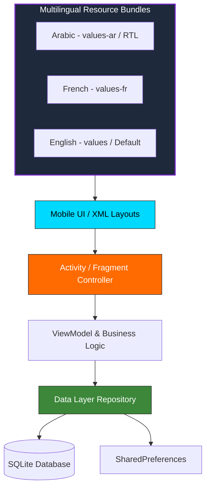

# Architecture Overview — ENIAD Native Android Mobile Architecture Suite

```mermaid
graph TD
    A[Mobile UI / XML Layouts] --> B[Activity / Fragment Controller]
    B --> C[ViewModel & Business Logic]
    C --> D[Data Layer Repository]
    D --> E[(SQLite Database)]
    D --> F[SharedPreferences]
    subgraph Localization [Multilingual Resource Bundles]
        AR[Arabic - values-ar / RTL]
        FR[French - values-fr]
        EN[English - values / Default]
    end
    Localization --> A
    style A fill:#00D9FF,stroke:#333,stroke-width:1px,color:#000
    style B fill:#FF6B00,stroke:#333,stroke-width:1px,color:#fff
    style D fill:#3C873A,stroke:#333,stroke-width:1px,color:#fff
    style Localization fill:#1E293B,stroke:#7928CA,stroke-width:2px,color:#fff

```
