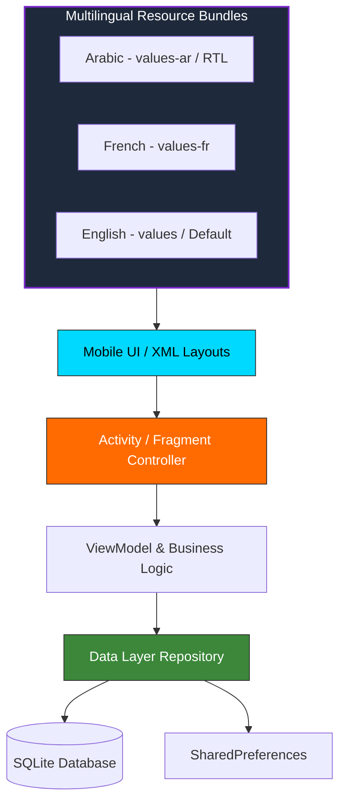

# Welcome to the ENIAD Native Android Mobile Architecture Suite Documentation Wiki 📖

Welcome to the official technical documentation and engineering reference for **ENIAD Native Android Mobile Architecture Suite**.

---

## 🎯 Academic & Technical Mission

Native Android Engineering Suite featuring Clean Architecture, Material Design UI, Full Trilingual Localization (Arabic RTL, French, English), and SQLite Data Persistence.

Developed within the **State Engineering Degree in Artificial Intelligence & Digital Systems** at the **École Nationale d'Intelligence Artificielle et du Digital (ENIAD)**, Berkane, Morocco.

---

## 📚 Wiki Documentation Chapters

| Chapter | Description | Primary Topics |
| :--- | :--- | :--- |
| **[[Architecture]]** | Deep architectural design & component topology | Mermaid diagrams, component interactions, runtime environment |
| **[[Getting-Started]]** | Developer setup & workstation configuration | Prerequisites, toolchain setup, execution commands |
| **[[Curriculum-Guide]]** | Detailed syllabus and laboratory breakdown | Lab objectives, expected outputs, deliverables |

---

## 🏛️ System Architecture Snapshot

---

## 📱 Android Architecture & Best Practices

- **Separation of Concerns**: UI rendering is decoupled from data retrieval and state manipulation.
- **RTL Support**: Native bidirectional layout handling via `android:supportsRtl="true"` and `start/end` attributes.
- **Storage Layer**: SQLiteOpenHelper pattern implementing safe database migrations and parameterized queries to prevent SQL injection.
- **Resource Management**: Extracted string, color, and dimension resources for effortless theme adaptation.

---

*Maintained with ❤️ by [Oussama EL HADJI](https://github.com/Bosaj) • ENIAD Berkane*
